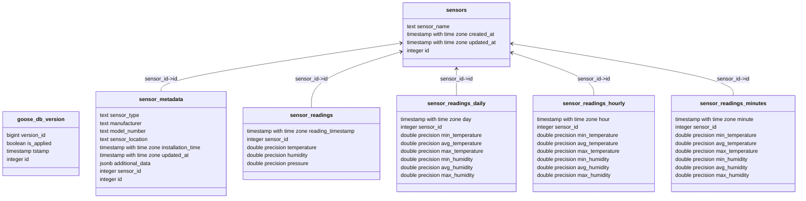

# pih-core-go

Golang-based MQTT consumer service & Web API service.

## DB Architecture

```mermaid
classDiagram
direction BT
class goose_db_version {
   bigint version_id
   boolean is_applied
   timestamp tstamp
   integer id
}
class sensor_metadata {
   text sensor_type
   text manufacturer
   text model_number
   text sensor_location
   timestamp with time zone installation_time
   timestamp with time zone updated_at
   jsonb additional_data
   integer sensor_id
   integer id
}
class sensor_readings {
   timestamp with time zone reading_timestamp
   integer sensor_id
   double precision temperature
   double precision humidity
   double precision pressure
}
class sensor_readings_daily {
   timestamp with time zone day
   integer sensor_id
   double precision min_temperature
   double precision avg_temperature
   double precision max_temperature
   double precision min_humidity
   double precision avg_humidity
   double precision max_humidity
}
class sensor_readings_hourly {
   timestamp with time zone hour
   integer sensor_id
   double precision min_temperature
   double precision avg_temperature
   double precision max_temperature
   double precision min_humidity
   double precision avg_humidity
   double precision max_humidity
}
class sensor_readings_minutes {
   timestamp with time zone minute
   integer sensor_id
   double precision min_temperature
   double precision avg_temperature
   double precision max_temperature
   double precision min_humidity
   double precision avg_humidity
   double precision max_humidity
}
class sensors {
   text sensor_name
   timestamp with time zone created_at
   timestamp with time zone updated_at
   integer id
}

sensor_metadata  -->  sensors : sensor_id->id
sensor_readings  -->  sensors : sensor_id->id
sensor_readings_daily  -->  sensors : sensor_id->id
sensor_readings_hourly  -->  sensors : sensor_id->id
sensor_readings_minutes  -->  sensors : sensor_id->id
```
